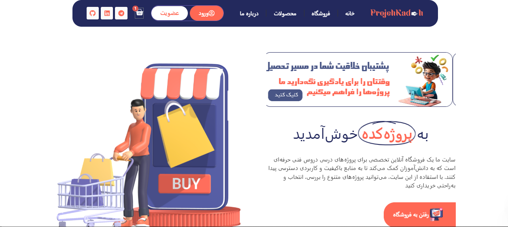

# پروژه‌کده

**پروژه‌کده** یک وبسایت فروشگاهی مبتنی بر **وردپرس** است که به دانش‌آموزان، هنرجویان و علاقه‌مندان به یادگیری کمک می‌کند تا پروژه‌های دانش‌آموزی و هنرجویی خود را به راحتی پیدا، خریداری و دانلود کنند. این وبسایت به عنوان یک پلتفرم جامع، پروژه‌های متنوعی را در دسته‌بندی‌های مختلف ارائه می‌دهد تا نیازهای آموزشی و پژوهشی کاربران را به بهترین شکل برطرف کند.

## لینک سایت

برای مشاهده وبسایت و کشف پروژه‌های جذاب، به لینک زیر مراجعه کنید:

[🌐 مشاهده وبسایت پروژه‌کده](https://projehkadeh.ir)

## تصویر پروژه

در زیر یک تصویر از پروژه شما قرار دارد:

  <!-- لینک تصویر خود را جایگزین کنید -->

## هدف پروژه‌کده

هدف اصلی **پروژه‌کده**، ایجاد یک بستر جامع و قابل اعتماد برای دانش‌آموزان و هنرجویان است تا بتوانند به راحتی به پروژه‌های مورد نیاز خود دسترسی داشته باشند. این وبسایت نه‌تنها به کاربران کمک می‌کند تا پروژه‌های خود را تکمیل کنند، بلکه به آن‌ها این امکان را می‌دهد تا از ایده‌ها و نمونه‌کارهای دیگران الهام بگیرند و مهارت‌های خود را ارتقا دهند.

## مشارکت و پشتیبانی

اگر شما هم علاقه‌مند به مشارکت در توسعه این پروژه هستید یا سوالی دارید، می‌توانید از طریق بخش [Issues](https://github.com/WhileTrue0087/ProjehkadehRepo) در گیتهاب با ما در ارتباط باشید. همچنین برای ارتباط مستقیم، می‌توانید به آدرس ایمیل [Email](taha.jami.087@gmail.com) پیام بفرستید

---

# Projehkadeh

**Projehkadeh** is a **WordPress**-based e-commerce website that helps students, trainees, and learning enthusiasts easily find, purchase, and download their student and trainee projects. This website serves as a comprehensive platform, offering a variety of projects in different categories to best meet the educational and research needs of users.

## Website Link

To visit the website and explore exciting projects, click the link below:

[🌐 Visit Projehkadeh Website](https://projehkadeh.ir)

## Project Image

Below is an image of your project:

  <!-- Replace with your image link -->

## Goal of Projehkadeh

The main goal of **Projehkadeh** is to create a comprehensive and reliable platform for students and trainees to easily access the projects they need. This website not only helps users complete their projects but also allows them to draw inspiration from others' ideas and samples, enhancing their skills.

## Contribution and Support

If you are interested in contributing to the development of this project or have any questions, you can reach out to us through the [Issues](https://github.com/WhileTrue0087/ProjehkadehRepo) section on GitHub. For direct communication, you can also send an email to [Email](taha.jami.087@gmail.com).
